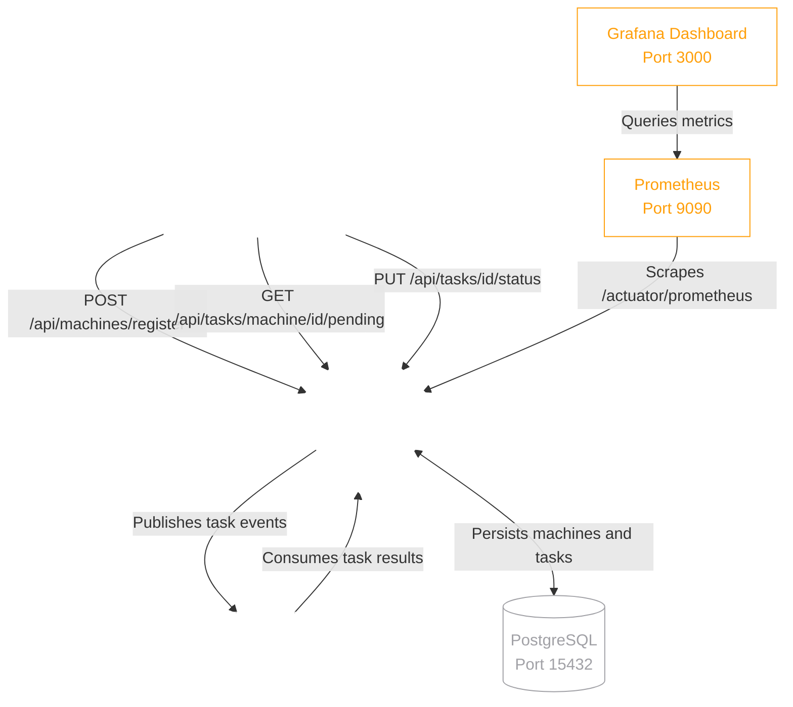
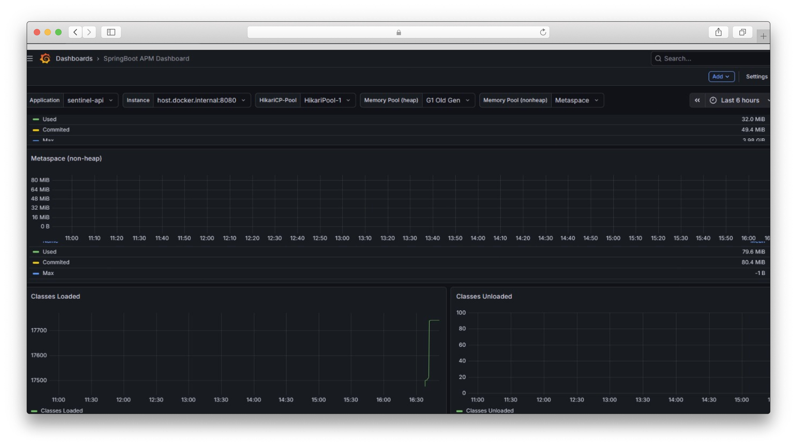
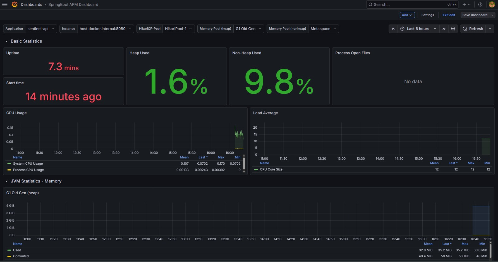
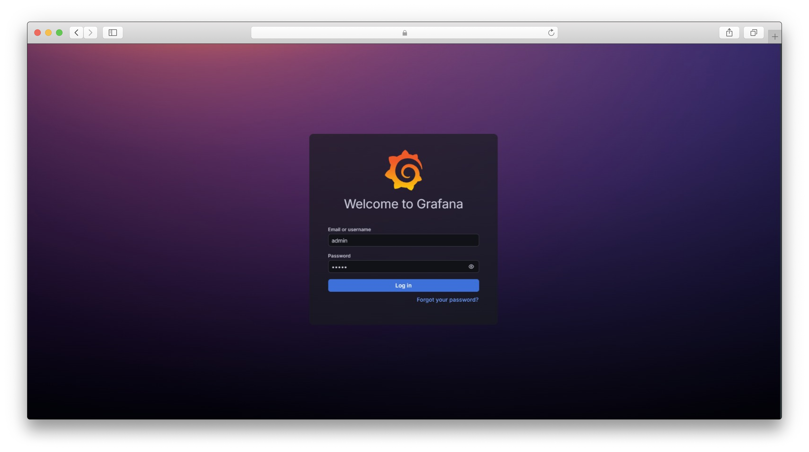
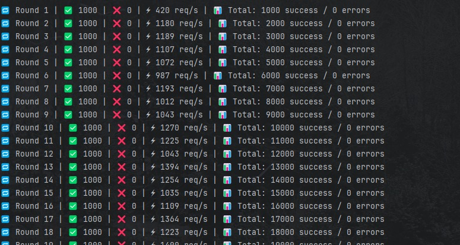

<div align="center">

  <br>
  

  <h1 style="color: #FFFFFF; font-family: -apple-system, BlinkMacSystemFont, 'Segoe UI', Roboto, Helvetica, Arial, sans-serif;">
    <b>SENTINEL</b>
  </h1>
  <p style="color: #A1A1A6;"><i>Event-Driven Remote Monitoring & Task Execution Microservice</i></p>

  <a href="https://github.com/pedroforbeck/sentinel">
    
  </a>

  <br><br>

  
  
  
  
  
  

  <br><br>

  
  
  

  <br><br>

  

</div>

<br><br>

> **Abstract**
> **Sentinel** is a distributed system for remote machine monitoring and task execution, built on an event-driven architecture using **Apache Kafka**. It consists of two core components: a centralized **REST API** that manages machine registration and task lifecycle, and a lightweight **Agent** that runs on remote machines, self-registers, polls for pending tasks, executes them, and reports results asynchronously. The entire system is instrumented with a full observability stack — **Spring Boot Actuator**, **Micrometer**, **Prometheus**, and **Grafana** — providing real-time JVM, HTTP, and database metrics.

<br>

##  Table of Contents

- [System Architecture](#-system-architecture)
- [Components](#-components)
- [Observability Stack](#-observability-stack)
- [Screenshots](#-screenshots)
- [API Reference](#-api-reference)
- [Development Roadmap](#-development-roadmap)
- [Deployment and Setup](#-deployment--setup)

---

##  System Architecture

Sentinel decouples task execution from task management through an asynchronous message broker. The API handles all inbound requests and persists state to PostgreSQL. The Agent operates independently on remote machines, communicating task results back via Kafka topics. The monitoring stack runs as sidecar containers, scraping metrics without impacting application performance.

<br>



---

##  Components

### Sentinel API

The central command hub. Exposes a secured REST API for machine registration, task creation and lifecycle management. Built with Spring Boot 4, Spring Data JPA, Flyway for schema migrations, and Spring Kafka for async event publishing.

| Responsibility | Technology |
| :--- | :--- |
| REST API | Spring Boot 4 + Spring WebMVC |
| Persistence | Spring Data JPA + PostgreSQL + Flyway |
| Async Messaging | Apache Kafka |
| Observability | Spring Actuator + Micrometer + Prometheus |
| Security | API Key Authentication via `X-API-KEY` header |

### Sentinel Agent

A lightweight autonomous process deployed on any remote machine. On startup it self-registers with the API, then continuously polls for pending tasks, executes them locally, and reports results back asynchronously via Kafka.

| Responsibility | Behavior |
| :--- | :--- |
| Self-Registration | Sends hostname, IP, and OS info on startup |
| Task Polling | Periodically fetches `PENDING` tasks from the API |
| Task Execution | Executes shell commands locally |
| Result Reporting | Updates task status to `COMPLETED` or `FAILED` via Kafka |

---

##  Observability Stack

Sentinel ships with a fully integrated observability stack out of the box. All containers are defined in `docker-compose.yml` and start together with a single command.

| Endpoint | Description |
| :--- | :--- |
| `GET /actuator/health` | Database, Kafka, disk and liveness status |
| `GET /actuator/metrics` | JVM, HTTP, thread and GC metrics |
| `GET /actuator/prometheus` | Prometheus-formatted scrape endpoint |
| `GET /actuator/flyway` | Database migration history |
| `localhost:9090` | Prometheus query UI |
| `localhost:3000` | Grafana live dashboard |

The Grafana dashboard provides real-time visibility into:

- **JVM Memory** — Heap and Non-Heap usage across G1GC pools
- **CPU Usage** — System and Process CPU over time
- **HTTP Statistics** — Request rate, response time and error rate per endpoint
- **HikariCP** — Connection pool active, idle and pending connections
- **GC Statistics** — Pause times and memory promotion rates
- **Logback** — Log event rate per level (INFO, WARN, ERROR, DEBUG)

---

##  Screenshots

Visualizing the Sentinel API's performance, metrics, and logs during standard operation and under stress testing.

<table align="center">
  <tr>
    <td align="center"><b>Grafana Dashboard</b><br><br></td>
    <td align="center"><b>Dashboard Under Stress Test</b><br><br></td>
  </tr>
  <tr>
    <td align="center"><b>Grafana Login</b><br><br></td>
    <td align="center"><b>Application Logs</b><br><br></td>
  </tr>
</table>

---

##  API Reference

All endpoints require the `X-API-KEY` header.

### Machines

| Method | Endpoint | Description |
| :--- | :--- | :--- |
| `POST` | `/api/machines/register` | Register or update a machine |
| `GET` | `/api/machines` | List all registered machines |

### Tasks

| Method | Endpoint | Description |
| :--- | :--- | :--- |
| `POST` | `/api/tasks/machine/{machineId}` | Create a task for a machine |
| `GET` | `/api/tasks/machine/{machineId}/pending` | Get pending tasks for a machine |
| `PUT` | `/api/tasks/{taskId}/status` | Update task status and output |

---

##  Development Roadmap

- [x] **Phase 1:** Project initialization, PostgreSQL schema and Flyway migrations
- [x] **Phase 2:** Apache Kafka consumer/producer configuration
- [x] **Phase 3:** Machine registration and task lifecycle REST API
- [x] **Phase 4:** Sentinel Agent with self-registration and task polling
- [x] **Phase 5:** Full observability stack — Actuator, Prometheus, Grafana
- [ ] **Phase 6:** Spring Security — protect Actuator and API endpoints
- [ ] **Phase 7:** Dockerize API and Agent
- [ ] **Phase 8:** Threat detection rules — flag anomalous task failure rates
- [ ] **Phase 9:** Admin REST endpoints for querying audit logs

---

##  Deployment & Setup

### Prerequisites

- Java 17+
- Maven 3.8+
- Docker + Docker Compose

### 1. Clone & Start Infrastructure

```bash
git clone [https://github.com/pedroforbeck/sentinel.git](https://github.com/pedroforbeck/sentinel.git)
cd sentinel
git checkout develop

# Start PostgreSQL, Kafka, Prometheus and Grafana
docker-compose up -d
```

### 2. Configure the API

Copy the example properties and fill in your values:

```bash
cp sentinel-api/api/src/main/resources/application.properties.example \
   sentinel-api/api/src/main/resources/application.properties
```

### 3. Run the API

```bash
cd sentinel-api/api
mvn spring-boot:run
```

Verify at: `http://localhost:8080/actuator/health`

### 4. Run the Agent

```bash
cd sentinel-agent/agent
mvn spring-boot:run
```

The agent will self-register and begin polling for tasks.

### 5. Open Grafana Dashboard

```
http://localhost:3000  →  admin / admin
Dashboards → SpringBoot APM Dashboard
```

---

<div align="center">
  <br>
  <p style="color: #A1A1A6;">Architected and maintained by <b><a href="https://github.com/pedroforbeck" style="color: #A1A1A6; text-decoration: none;">Pedro Forbeck</a></b>.</p>
  <p>
    <a href="https://github.com/pedroforbeck">
      
    </a>
    <a href="https://www.linkedin.com/in/pedro-forbeck-180a98390/">
      
    </a>
  </p>
</div>
