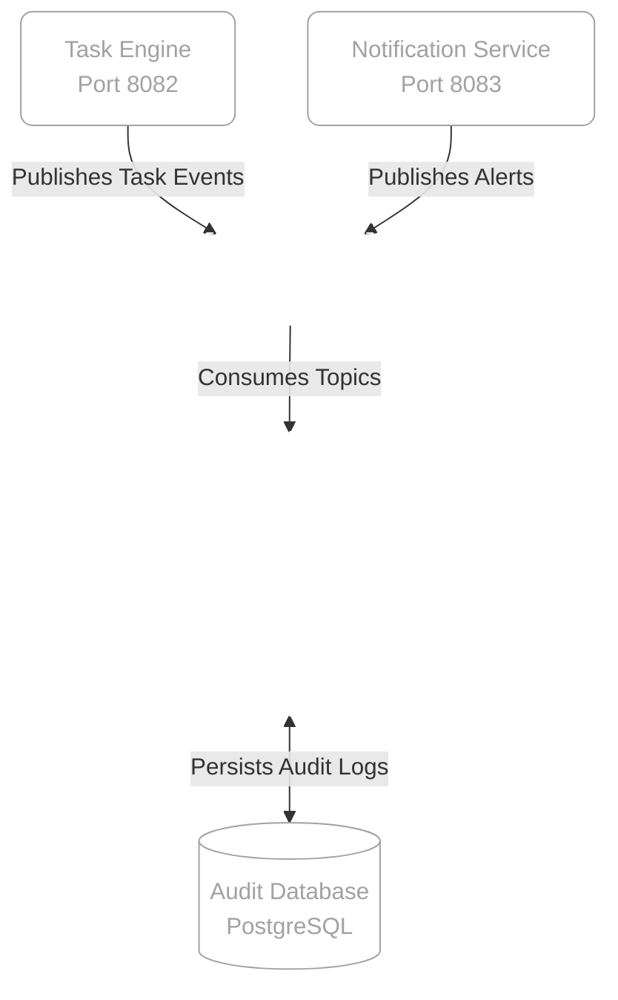

<div align="center">

  <br>
  

  <h1 style="color: #FFFFFF; font-family: -apple-system, BlinkMacSystemFont, 'Segoe UI', Roboto, Helvetica, Arial, sans-serif;">
    <b>SENTINEL</b>
  </h1>
  <p style="color: #A1A1A6;"><i>Event-Driven Monitoring & Security Auditing Microservice</i></p>

  <a href="https://github.com/pedroforbeck/sentinel">
    
  </a>

  <br><br>

  
  
  
  

  <br><br>

  
  
  

</div>

<br><br>

> **Abstract**<br>
> This repository contains **Sentinel**, a centralized monitoring and auditing service currently under active development. Acting as the silent observer of the ecosystem, its primary responsibility is to consume events asynchronously via **Apache Kafka**. It records user actions, system alerts, and task statuses in real-time, providing an immutable audit trail without impacting the performance of the core domain microservices.

<br>

##  Table of Contents

- [System Architecture](#-system-architecture)
- [Core Capabilities](#-core-capabilities)
- [Development Roadmap](#-development-roadmap)
- [Deployment & Setup](#-deployment--setup)

---

##  System Architecture

By leveraging a message broker, Sentinel completely decouples the logging and monitoring logic from the rest of the application. Core services (like the Task Engine) simply publish events to Kafka topics and continue executing. Sentinel independently consumes these topics, processes the payloads, and persists them for future querying and security analysis.

<br>

<details>
<summary><b style="color: #A1A1A6; cursor: pointer;">View Component Topology (Glass/Wireframe Diagram)</b></summary>
<br>


</details>

---

##  Core Capabilities

| Feature | Description |
| :--- | :--- |
|  **Kafka Integration** | Consumes streams of high-throughput data asynchronously via dedicated Kafka topics. |
|  **Immutable Auditing** | Persists a reliable, unalterable log of cross-service activities into a centralized PostgreSQL database. |
|  **System Observability** | Centralizes payload monitoring to track bottlenecks, failures, and unauthorized access attempts. |
|  **Fault Tolerance** | Designed to survive network spikes; if Sentinel goes down, Kafka retains the events until it spins back up. |

---

##  Development Roadmap

As a **Work in Progress (WIP)**, Sentinel is being built iteratively. Below is the current progress of the core modules:

- [x] **Phase 1:** Project initialization and PostgreSQL schema setup.
- [x] **Phase 2:** Apache Kafka consumer configuration and listener bindings.
- [ ] **Phase 3:** Deserialization of complex system event payloads.
- [ ] **Phase 4:** Threat detection rules (e.g., flagging multiple failed tasks/logins).
- [ ] **Phase 5:** REST endpoints for administrators to query the audit logs.

---

##  Deployment & Setup

To run Sentinel locally, ensure you have **Java 17+**, **Maven 3.8+**, **PostgreSQL**, and **Apache Kafka / Zookeeper** running in your local environment or via Docker.

### 1. Database & Kafka Configuration
Ensure your PostgreSQL database (e.g., `db_sentinel`) is created. You will also need Kafka running on its default port (`9092`).

### 2. Environment Variables
Configure your `application.properties` or `application.yml` with your local credentials:

```yaml
# Server Configuration
server.port: 8084

# Database Configuration (Audit Schema)
spring.datasource.url: jdbc:postgresql://localhost:5432/db_sentinel
spring.datasource.username: your_postgres_user
spring.datasource.password: your_postgres_password
spring.jpa.hibernate.ddl-auto: update

# Apache Kafka Configuration
spring.kafka.bootstrap-servers: localhost:9092
spring.kafka.consumer.group-id: sentinel-auditor-group
spring.kafka.consumer.auto-offset-reset: earliest
```

### 3. Build & Execute
Navigate to the project root directory and start the Spring Boot application:

```bash
# Clone the repository
git clone https://github.com/pedroforbeck/sentinel.git
cd sentinel

# Switch to the active development branch
git checkout develop

# Run the application
./mvnw spring-boot:run
```

---

<div align="center">
  <br>
  <p style="color: #A1A1A6;">Architected and maintained by <b><a href="https://github.com/pedroforbeck" style="color: #A1A1A6; text-decoration: none;">Pedro Forbeck</a></b>.</p>
  <p>
    <a href="https://github.com/pedroforbeck">
      
    </a>
    <a href="https://www.linkedin.com/in/pedro-forbeck-180a98390/">
      
    </a>
  </p>
</div>
