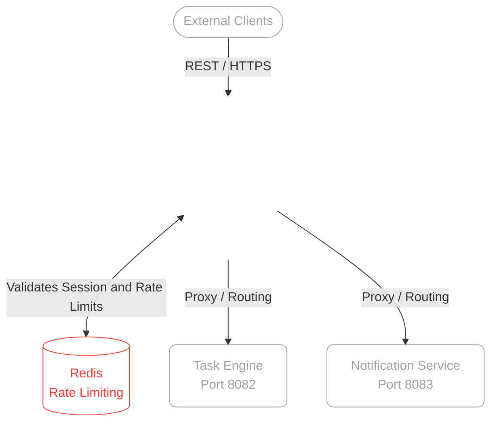

<div align="center">

  <br>
  

  <h1 style="color: #FFFFFF; font-family: -apple-system, BlinkMacSystemFont, 'Segoe UI', Roboto, Helvetica, Arial, sans-serif;">
    <b>SENTINEL</b>
  </h1>
  <p style="color: #A1A1A6;"><i>Centralized API Gateway & Security Monitoring Microservice</i></p>

  <a href="https://github.com/pedroforbeck/sentinel">
    
  </a>

  <br><br>

  
  
  
  

  <br><br>

  
  
  

</div>

<br><br>

> **Abstract**<br>
> This repository contains **Sentinel**, an intelligent API Gateway and security layer currently under active development. Acting as the single point of entry for the ecosystem, its primary responsibility is to handle cross-cutting concerns such as authentication, request routing, rate limiting, and threat monitoring before traffic ever hits the underlying domain microservices.

<br>

##  Table of Contents

- [System Architecture](#-system-architecture)
- [Core Capabilities](#-core-capabilities)
- [Development Roadmap](#-development-roadmap)
- [Deployment & Setup](#-deployment--setup)

---

##  System Architecture

By abstracting security and routing away from the core services (like the Task Engine and Notification Service), the ecosystem becomes inherently more scalable and secure. Sentinel intercepts incoming external requests, validates JWT tokens, checks rate limits against a Redis cache, and securely proxies the request to the correct internal port.

<br>

<details>
<summary><b style="color: #A1A1A6; cursor: pointer;">View Component Topology (Glass/Wireframe Diagram)</b></summary>
<br>


</details>

---

##  Core Capabilities

| Feature | Description |
| :--- | :--- |
|  **Authentication & JWT** | Validates incoming tokens centrally, ensuring unauthenticated requests are dropped at the edge. |
|  **Dynamic Routing** | Acts as a reverse proxy, mapping external API calls to internal microservice endpoints. |
|  **Rate Limiting** | Prevents abuse and DDoS attacks by throttling requests using a token bucket algorithm via Redis. |
|  **Traffic Observability** | Injects trace IDs and logs metric data for request profiling and debugging across the ecosystem. |

---

##  Development Roadmap

As a **Work in Progress (WIP)**, Sentinel is being built iteratively. Below is the current progress of the core modules:

- [x] **Phase 1:** Project initialization and reverse proxy configuration.
- [x] **Phase 2:** Integration of global JWT validation filters.
- [ ] **Phase 3:** Redis integration for distributed rate limiting.
- [ ] **Phase 4:** Circuit breakers and fallback mechanisms for downstream service failures.
- [ ] **Phase 5:** Comprehensive unit and integration test coverage.

---

##  Deployment & Setup

To run Sentinel locally, ensure you have **Java 17+**, **Maven 3.8+**, and **Redis** running.

### 1. Cache Configuration
Ensure your local Redis instance is running on the default port `6379`. This is required for the rate limiter to function.

### 2. Environment Variables
Configure your `application.properties` or `application.yml` with your local routing variables:

```yaml
# Server Configuration
server.port: 8080

# Redis Configuration (Rate Limiting)
spring.redis.host: localhost
spring.redis.port: 6379

# JWT Validation
api.security.token.secret: your_super_secret_key_here

# Microservice Routing Rules
routes.task-engine.url: http://localhost:8082
routes.notification-service.url: http://localhost:8083
```

### 3. Build & Execute
Navigate to the project root directory and start the Gateway application:

```bash
# Clone the repository
git clone https://github.com/pedroforbeck/sentinel.git

# Navigate to the directory
cd sentinel

# Run the application
./mvnw spring-boot:run
```

---

<div align="center">
  <br>
  <p style="color: #A1A1A6;">Architected and maintained by <b><a href="https://github.com/pedroforbeck" style="color: #A1A1A6; text-decoration: none;">Pedro Forbeck</a></b>.</p>
  <p>
    <a href="https://github.com/pedroforbeck">
      
    </a>
    <a href="https://www.linkedin.com/in/pedro-forbeck-180a98390/">
      
    </a>
  </p>
</div>
